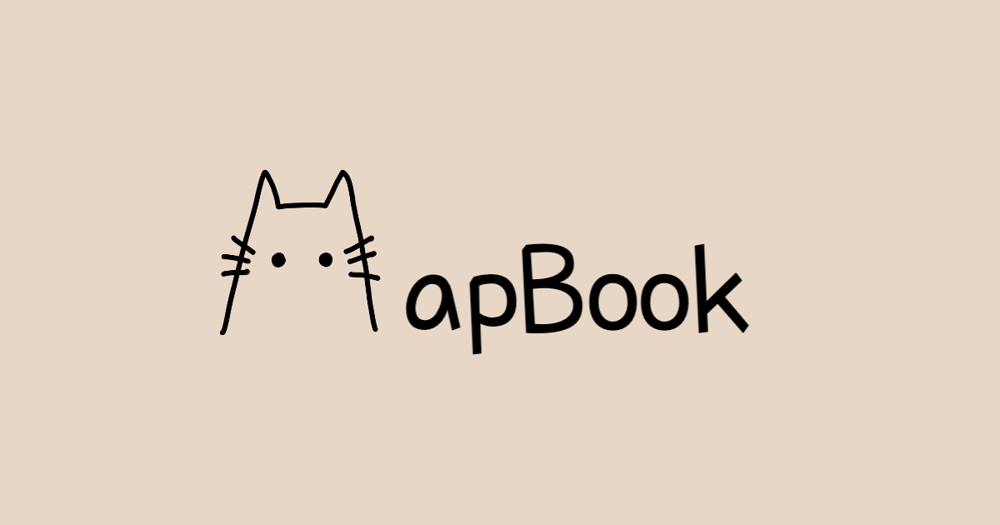

"# LibraryService"

# MapBook 
### 빠르고 유연한 검색 / 검색어 기반 추천도서 / 주변 도서관 대여여부 확인

# 프로젝트 설명
- 프로젝트 이름 : [mapbook.pro](http://mapbook.pro) (책있나?)**
# 프로젝트 목표
- 서비스 목표 : 공공도서관 웹 사용성 개선
    - 도서 검색과 대여가능여부 확인이 원스톱으로 이뤄지도록
    - 도서판매 사이트(교보문고, yes24)가 지원하는 검색기능을 공공도서관에서도 사용할 수 있도록
    - OpenAPI 장애 시에도 서비스 가능하도록

- 챌린지 목표 : Java, Spring, MySQL 이해도를 높이기 위해 외부 서비스 사용을 지양하고 직접 구현
    - ElasticSearch를 사용하지 않고 빠르고 유연한 검색 구현 → 이후 외부서비스 적용하고 비교
    - Redis를 사용하지 않고 캐싱 구현
    - 라이브러리 사용하지 않고 서킷브레이커 구현
  
- 프로젝트 둘러보기
    - [MapBook 사용해보기](https://mapbook.pro/)
    - [MapBook Notion](https://www.notion.so/TeamScaling-MapBook-9bfd3aadc2a54a2e9c32a7ebd08409e6)
