# MapBook
> No more searching each library separately, search them all at once with MapBook!  
> Don't bother finding where to borrow books, let MapBook automatically search the libraries around you!

### Service Goals
- Improve the usability of public library web services.
    - Allow users to search for books and check their availability in one stop.
    - Enable search functions supported by bookstore sites (such as Kyobo Bookstore and Yes24) to be used in public libraries.
    - Ensure the service is available even in the event of an OpenAPI failure.

### Challenge Goals
- Improve understanding of Java, Spring, and MySQL by avoiding the use of external services and implementing them directly.
    - Implement a fast and flexible search without using ElasticSearch, and compare with external services later.
    - Implement caching without using Redis.
    - Implement circuit breakers without using libraries.

### Explore the Project
- [Try MapBook](https://mapbook.pro/)
- [MapBook Notion](https://www.notion.so/TeamScaling-MapBook-9bfd3aadc2a54a2e9c32a7ebd08409e6)

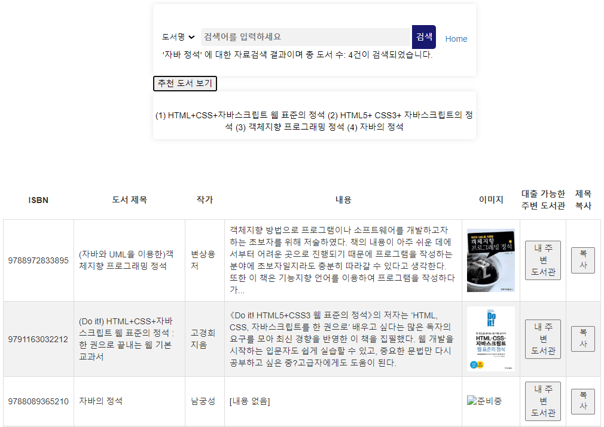
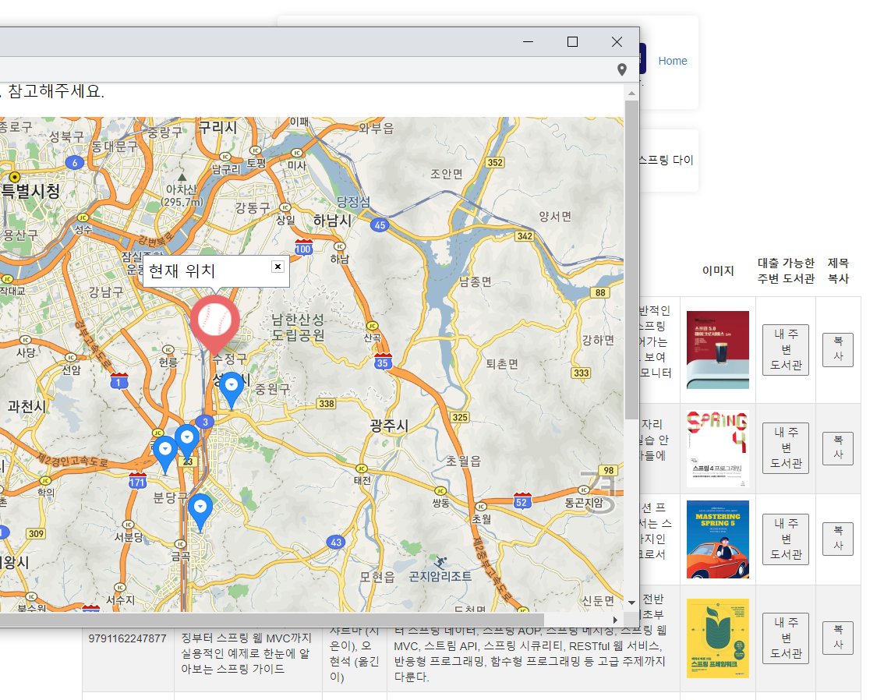

<h1>📚 STACKS</h1>

 
   
  
  
  
  
   

   

### Project Duration & Team
- Duration: 2023.03.31 - 2023.05.12 (6 weeks)
- Team: 4 Backend Developers

### Backend Technology
- Java
- Spring Boot
- Spring JPA
- Thymeleaf
- Komoran
- Junit5
- WireMock
- Mockito

### Infrastructure
- AWS EC2
- Github CI/CD
- AWS RDS (Mysql 8.0)

### Open API
- Kakao Map
- Library Information System (for book availability check)

### Project Characteristics
- This is a 'challenge project' consisting of backend developers only.
- We focused on implementing essential UI and mainly concentrated on backend technologies.

<h1>📝 Class Diagram</h1>

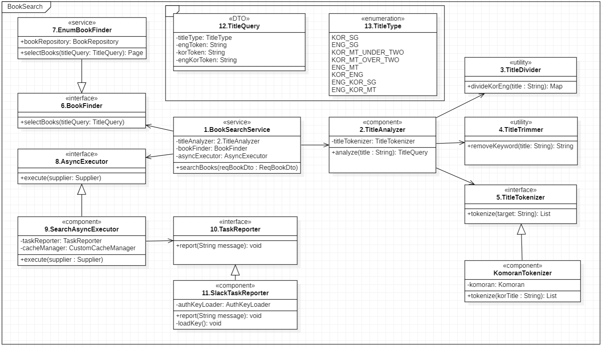
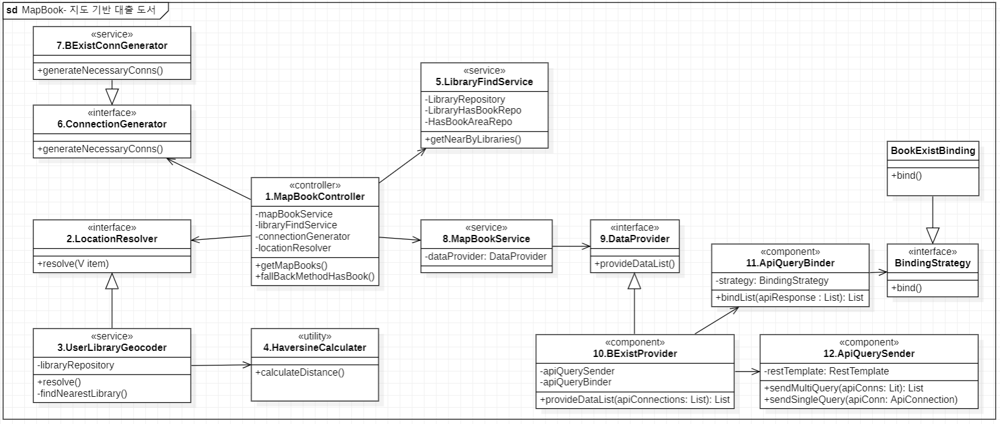
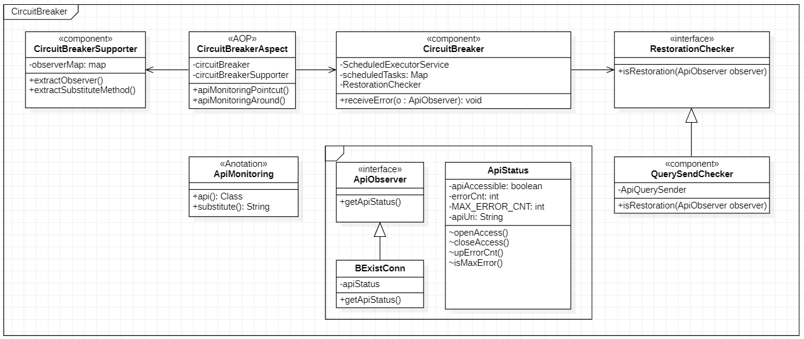

<h1>📝 Sequence Diagram</h1>

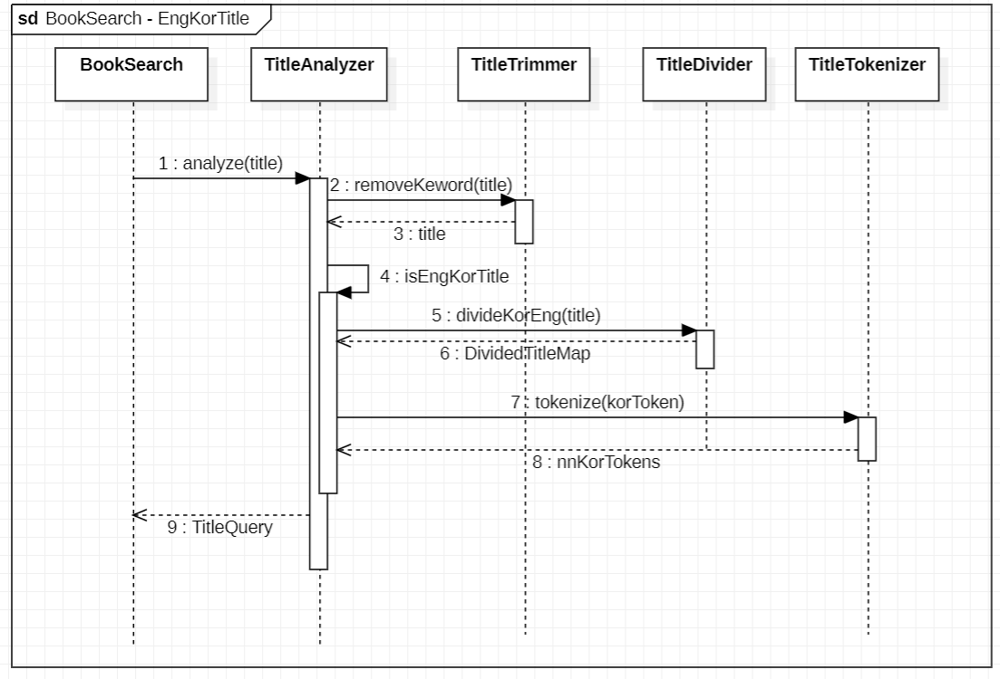
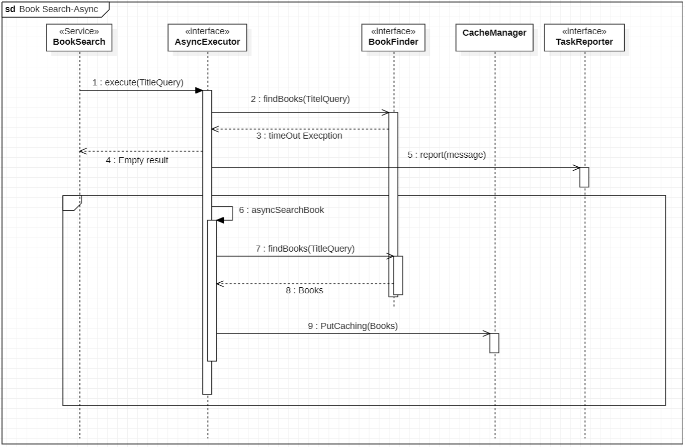
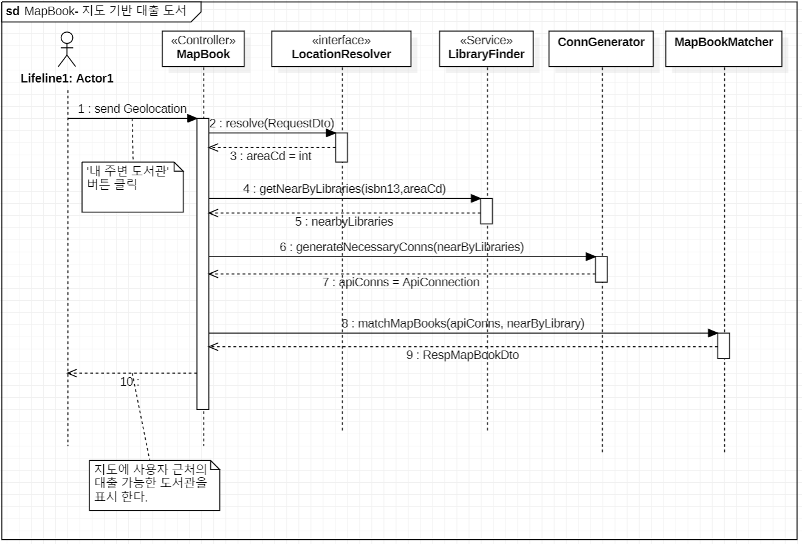
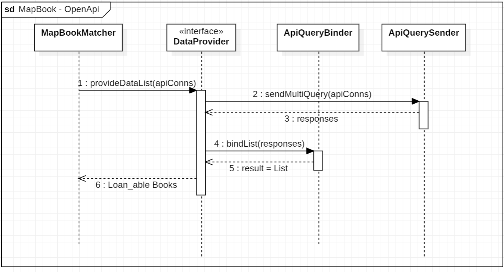
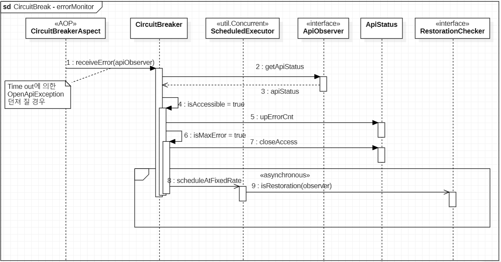
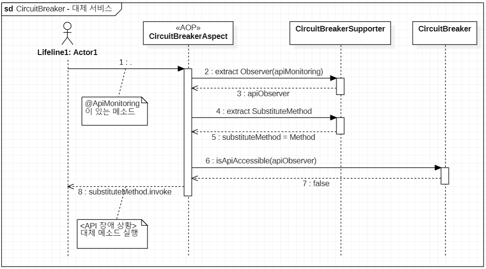

