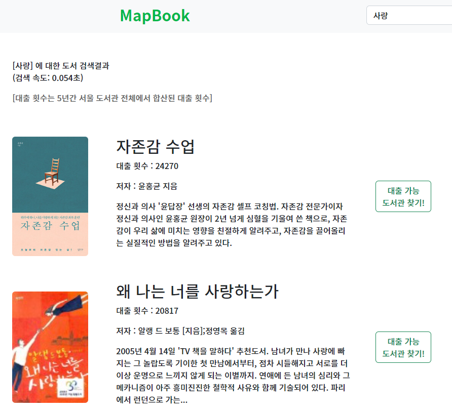
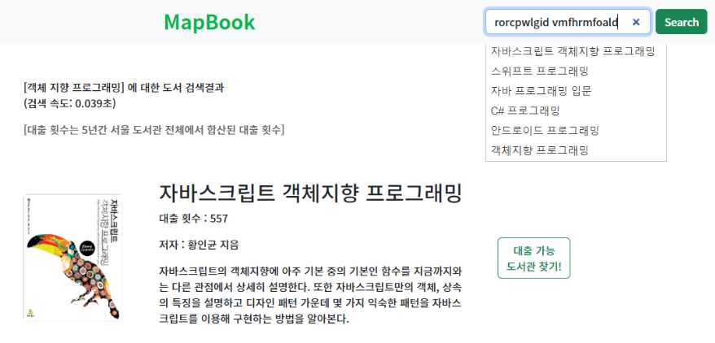
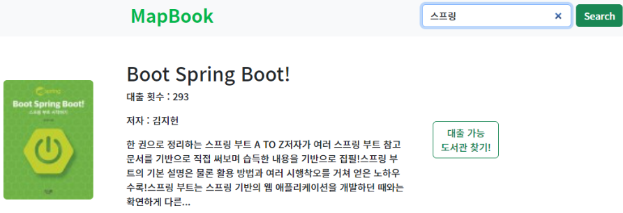
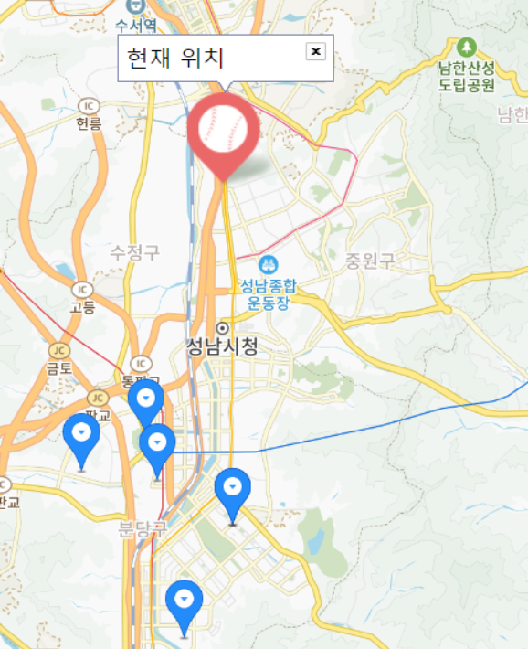

# MapBook

> 도서관 책 찾을려고 일일이 도서관 사이트 들어가서 검색 하지 마세요!    
> 열심히 찾았는데, 대출 가능한 도서관 어딨는지 또 찾지 마세요!

### Service Goals

1. 도서관 도서 통합 검색 플랫폼
2. 지도 기반 대출 가능한 도서관 찾기 서비스

### Challenge Goals

ElasticSearch 없이 RDBMS로만 가지고 검색 엔진 만들기

### Explore the Project

- [Try MapBook](https://mapbook.pro/)

## 기능 소개

1. 0.2s 이내 빠른 검색 속도 및 대출 횟수 기반 결과  
    

2. 검색어 자동 완성  
     
 

3. 한영 오타 자동 전환 검색 기능  
     

4. 한영 오타 자동 전환 검색 기능  
     

5. 클릭 한번에 내 주변 대출 가능 도서관 찾기  
     

<h1>📚 STACKS</h1>

 
   
  
  
  
  
   

   

### Project Duration & Team

- Duration: 2023.03.31 - 2023.07.26
- Team: 4 Backend Developers

### Backend Technology

- Java
- Spring Boot
- Spring JPA
- Thymeleaf
- eunjeon (자연어 분석)
- Junit5
- WireMock
- Mockito

### Infrastructure

- AWS EC2
- Github CI/CD
- AWS RDS (Mysql 8.0)

### Open API

- Kakao Map
- Library Information System (for book availability check)

### Book Data

- 3,740,754 raws
- ~ 23년 4월 도서 데이터 최신화 완료